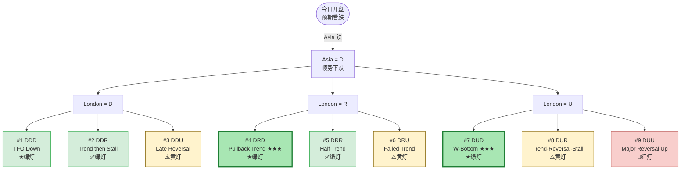
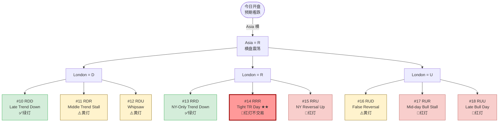
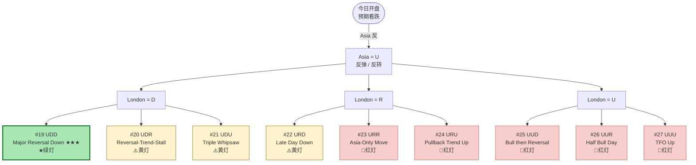

**版本：v1.0 | 日期：2026-05 | 适用：5min-1H 日内交易 | 状态：生效**

# 27 种日内 Day Type 完整流程图

> 任何一天有 **3³ = 27 种**走法变化。本文档把它**全部画出来**，每一种都对应：
> + Brooks Day Type 名称
> + 日 K 形态预测
> + 符合预期程度（绿灯 / 黄灯 / 红灯）
> + 你的动作

---

## 一、坐标系定义

### 1.1 三时段 × 三状态

```plain
3 个时段:        Asia    London    NY
每段 3 种状态:    D / R / U
总变化数:        3 × 3 × 3 = 27 种
```

### 1.2 状态量化

| 状态 | 5min 单时段量化 | 含义 |
|---|---|---|
| **D** (Down) | 时段收 < 时段开 - 0.3 × ATR(D) | 顺势下跌 |
| **R** (Range) | \|时段收 - 时段开\| < 0.3 × ATR(D) | 横盘震荡 |
| **U** (Up) | 时段收 > 时段开 + 0.3 × ATR(D) | 反弹 / 反转 |

### 1.3 编号规则

```plain
按 Asia → London → NY 字典序编号 #1 - #27
例: #1 = D-D-D
    #14 = R-R-R
    #27 = U-U-U
```

---

## 二、ASCII 完整流程图（按 Asia 状态分组）

### 2.1 Asia = D（顺势下跌）

```plain
                Asia = D
            ┌──────┬──────┬──────┐
            ↓      ↓      ↓
          L = D   L = R   L = U
          ┌─┬─┬─┐ ┌─┬─┬─┐ ┌─┬─┬─┐
          ↓ ↓ ↓  ↓ ↓ ↓  ↓ ↓ ↓
          D R U  D R U  D R U     ← NY
         #1 #2 #3 #4 #5 #6 #7 #8 #9

#1 D-D-D ★绿灯  TFO Down (一气呵成)
#2 D-D-R ✅绿灯  Trend then Stall
#3 D-D-U ⚠️黄灯  Late Reversal Day
#4 D-R-D ★绿灯  Pullback Trend Day  ← 高质量做空日 ★★★
#5 D-R-R ✅绿灯  Half Trend Early
#6 D-R-U ⚠️黄灯  Failed Trend Down
#7 D-U-D ★绿灯  W-Bottom Day  ← 高质量做空日 ★★★
#8 D-U-R ⚠️黄灯  Trend-Reversal-Stall
#9 D-U-U 🛑红灯  Major Trend Reversal Up
```

### 2.2 Asia = R（横盘震荡）

```plain
                Asia = R
            ┌──────┬──────┬──────┐
            ↓      ↓      ↓
          L = D   L = R   L = U
          ┌─┬─┬─┐ ┌─┬─┬─┐ ┌─┬─┬─┐
          ↓ ↓ ↓  ↓ ↓ ↓  ↓ ↓ ↓
          D R U  D R U  D R U
        #10 #11 #12 #13 #14 #15 #16 #17 #18

#10 R-D-D ✅绿灯  Late Trend Day Down
#11 R-D-R ⚠️黄灯  Middle Trend Stall
#12 R-D-U ⚠️黄灯  Whipsaw Day
#13 R-R-D ✅绿灯  NY-Only Trend Down
#14 R-R-R 🛑红灯  Tight Trading Range Day  ← 不交易日 ★★
#15 R-R-U 🛑红灯  NY Reversal Up
#16 R-U-D ⚠️黄灯  False Reversal Up
#17 R-U-R 🛑红灯  Mid-day Bull Stall
#18 R-U-U 🛑红灯  Late Bull Day
```

### 2.3 Asia = U（反弹 / 反转）

```plain
                Asia = U
            ┌──────┬──────┬──────┐
            ↓      ↓      ↓
          L = D   L = R   L = U
          ┌─┬─┬─┐ ┌─┬─┬─┐ ┌─┬─┬─┐
          ↓ ↓ ↓  ↓ ↓ ↓  ↓ ↓ ↓
          D R U  D R U  D R U
        #19 #20 #21 #22 #23 #24 #25 #26 #27

#19 U-D-D ★绿灯  Major Reversal Down Day  ← 高质量做空日 ★★★
#20 U-D-R ⚠️黄灯  Reversal-Trend-Stall
#21 U-D-U ⚠️黄灯  Triple Whipsaw
#22 U-R-D ⚠️黄灯  Late Day Down
#23 U-R-R 🛑红灯  Asia-Only Move
#24 U-R-U 🛑红灯  Pullback Trend Up
#25 U-U-D 🛑红灯  Bull then Reversal
#26 U-U-R 🛑红灯  Half Bull Day
#27 U-U-U 🛑红灯  TFO Up (完全反转日)
```

---

## 三、Mermaid 视觉版（按 Asia 起点）

### 3.1 Asia = D 子流程图



### 3.2 Asia = R 子流程图



### 3.3 Asia = U 子流程图



---

## 四、27 种日 K 形态预测（核心查询表）

> 每种 day type 在收盘后**日图上呈现的 K 线长什么样**——这是 Brooks day type 的真正价值。

| # | 模式 | Brooks Day Type | 日 K 形态预测 | 符合 | 仓位 | 行动 |
|---|---|---|---|---|---|---|
| 1 | DDD | TFO Down | 大阴 K，无影线，实体满 | ★★★ | 100% | 持有 trailing |
| 2 | DDR | Trend then Stall | 阴 K，下影短，上影长 | ★★ | 100% | TP1 后保留 |
| 3 | DDU | Late Reversal | 阴 K，下影线长，实体小 | ⚠️ | 0% | NY 平仓 |
| 4 | DRD | **Pullback Trend** | 阴 K，中等实体，影线短 | **★★★** | **100%** | **L2 入场** |
| 5 | DRR | Half Trend | 小阴 K，影线短 | ★★ | 70% | Asia 入, 后平 |
| 6 | DRU | Failed Trend | 阴 K，下影长 | ⚠️ | 0% | NY 平 |
| 7 | DUD | **W-Bottom Day** | 阴 K，下影线长，上影也有 | **★★★** | **100%** | **L2 入场 ★** |
| 8 | DUR | Trend-Reversal-Stall | doji 偏阴，影线两边 | ⚠️ | 30% | 谨慎 |
| 9 | DUU | Major Reversal Up | 阳 K，下影线长 | 🛑 | 0% | 不交易 |
| 10 | RDD | Late Trend Down | 阴 K，上影长 | ★★ | 70% | London 才入 |
| 11 | RDR | Middle Trend Stall | doji 偏阴 | ⚠️ | 30% | 难做 |
| 12 | RDU | Whipsaw | doji 上下影都长 | ⚠️ | 0% | 难做 |
| 13 | RRD | NY-Only Trend | 阴 K，上影长 | ★★ | 50% | NY 才入 |
| 14 | RRR | **Tight TR Day** | doji，实体极小 | 🛑 | **0%** | **不交易** |
| 15 | RRU | NY Reversal Up | 阳 K，下影长 | 🛑 | 0% | 不交易 |
| 16 | RUD | False Reversal | doji，上影长 | ⚠️ | 30% | 难做 |
| 17 | RUR | Mid-day Bull Stall | 小阳，影线两边 | 🛑 | 0% | 不交易 |
| 18 | RUU | Late Bull Day | 阳 K，下影短 | 🛑 | 0% | 不交易 |
| 19 | UDD | **Major Reversal Down** | 阴 K，上影线长 | **★★★** | **100%** | **L2 入场 ★** |
| 20 | UDR | Reversal-Trend-Stall | 阴 doji，上影长 | ⚠️ | 30% | 谨慎 |
| 21 | UDU | Triple Whipsaw | doji，上下影都极长 | ⚠️ | 0% | 不交易 |
| 22 | URD | Late Day Down | 阴 K，上影线极长 | ⚠️ | 50% | NY 才入 |
| 23 | URR | Asia-Only Move | 小阳，上影长 | 🛑 | 0% | 不交易 |
| 24 | URU | Pullback Trend Up | 阳 K，影线短 | 🛑 | 0% | 不交易 |
| 25 | UUD | Bull then Reversal | 阳 K，上影线长 | 🛑 | 0% | 不交易 |
| 26 | UUR | Half Bull Day | 阳 K，上影短 | 🛑 | 0% | 不交易 |
| 27 | UUU | TFO Up | 大阳 K，无影线 | 🛑 | 0% | 不交易 |

---

## 五、3 灯心理压缩版（实战速查）

> 27 种太多记不住。**实战中你只需要识别 3 灯**：

### 5.1 灯位映射

```plain
🟢 绿灯日 (8 种, 30%):
   #1 DDD, #2 DDR, #4 DRD ★, #5 DRR, #7 DUD ★,
   #10 RDD, #13 RRD, #19 UDD ★

   ★ 标注的是高质量日 (DRD / DUD / UDD = 三大主力日型)

🟡 黄灯日 (10 种, 37%):
   #3 DDU, #6 DRU, #8 DUR, #11 RDR, #12 RDU,
   #16 RUD, #20 UDR, #21 UDU, #22 URD

   注: 黄灯日大概率持平或微亏, 接受这一现实

🔴 红灯日 (9 种, 33%):
   #9 DUU, #14 RRR, #15 RRU, #17 RUR, #18 RUU,
   #23 URR, #24 URU, #25 UUD, #26 UUR, #27 UUU

   注: 红灯日唯一目标 = 不亏钱 = 不交易
```

### 5.2 心理对照

```plain
               业余                        专业
绿灯日       "今天必须赚到"             "今天可能赚到, 跑流程"
黄灯日       "看不出方向, 多试试"         "黄灯就是黄灯, 0R 收"
红灯日       "今天市场骗我"             "红灯日 = 不动 = 胜利"

业余结果: 绿灯日不一定赚, 黄红灯一定亏
专业结果: 绿灯日稳定赚, 黄灯持平, 红灯不亏
```

---

## 六、按"符合预期 vs 不符合"分组

### 6.1 完全符合（仅 1 种，4%）

```plain
#1 DDD - TFO Down
   日 K: 大阴, 无影线
   特征: 几乎不回调, 一直跌
   动作: 持有, trailing 跟随
```

### 6.2 大部分符合（6 种，22%）

```plain
2D + 1 其他:
   #2 DDR, #3 DDU, #4 DRD, #7 DUD, #10 RDD, #19 UDD

   特征: 至少 2 段下跌
   动作: 标准 setup 入场
```

### 6.3 部分符合（12 种，44%）

```plain
1D + 2 其他:
   #5 DRR, #6 DRU, #8 DUR, #9 DUU
   #11 RDR, #12 RDU, #13 RRD, #16 RUD
   #20 UDR, #21 UDU, #22 URD, #25 UUD

   特征: 仅 1 段下跌, 其他混乱
   动作: 严格过滤, 仓位减半
```

### 6.4 中性（1 种，4%）

```plain
#14 RRR - Tight Trading Range Day
   日 K: doji
   特征: 全天没动
   动作: 不交易, 接受 0R
```

### 6.5 不符合（7 种，26%）

```plain
0D + 其他 (不含 RRR):
   #15 RRU, #17 RUR, #18 RUU
   #23 URR, #24 URU, #26 UUR, #27 UUU

   特征: 没有任何一段顺势下跌
   动作: 接受预期错, 不交易
```

> 📌 **关键统计**：你预期看跌时，**真正"完全符合"的仅 4%**，**完全不符合的有 26%**，**最多的是部分符合 44%**。
> 这意味着你的剧本必须**默认"部分符合"**——而不是默认"完全符合"。

---

## 七、与流程图嵌套关系

```plain
日内剧本框架 (T0-T4)         ← 27 种 day type 在这里发挥作用
   ↓
8 阶段决策卡 (单笔)           ← 每个 setup 出现时
   ↓
L2 失败反弹流程图             ← 入场 setup 识别
   ↓
Always-In 5 步判断           ← 底层方向
   ↓
灵魂三问 (实时)               ← 持仓中
```

> 📌 **使用顺序**：T0 写预期 → T1 后识别 day type 概率分布 → T2/T3 在对应 day type 下找 setup → 走 L2 流程图 → 走 8 阶段卡 → 入场。

---

## 八、推荐查看方式

| 场景 | 用哪个 |
|---|---|
| 桌面 review / 编辑 / 美化 | `27-day-type-flowchart.drawio` (draw.io 源文件) |
| GitHub 内联 / PR diff | 本文档（Mermaid 直接渲染） |
| 终端 / 打印 / 桌边卡片 | 本文档第二节 ASCII |
| 实战速查 | 本文档第四节查询表 |
| 心理压缩 | 本文档第五节 3 灯版 |

---

## 九、Brooks 引用

```plain
"There are 24 day types I track. Most days fall into one of these.
 The trader who can identify the day type by 11am NY time
 has a tremendous edge over those who can't."
                            — Al Brooks, RPA 第 26 章

翻译: 我追踪 24 种日型. 大多数日子都属于其中之一.
     能在 NY 时间 11 点前识别当日类型的交易员
     比识别不了的有巨大优势.
```

> 我们扩展到 27 种是因为加入了 R-only 的 day types。Brooks 的 24 主要覆盖 trending 和 reversal 类型。

---

## 十、变更日志

```plain
v1.0 (2026-05):
  - 初版
  - 27 种 day type 全枚举
  - ASCII + Mermaid 双格式
  - draw.io 源文件
  - 日 K 形态预测查询表
  - 3 灯心理压缩版
  - 与做空方法论 / L2 流程图 / 8 阶段卡 / Always-In 卡的嵌套关系
```
