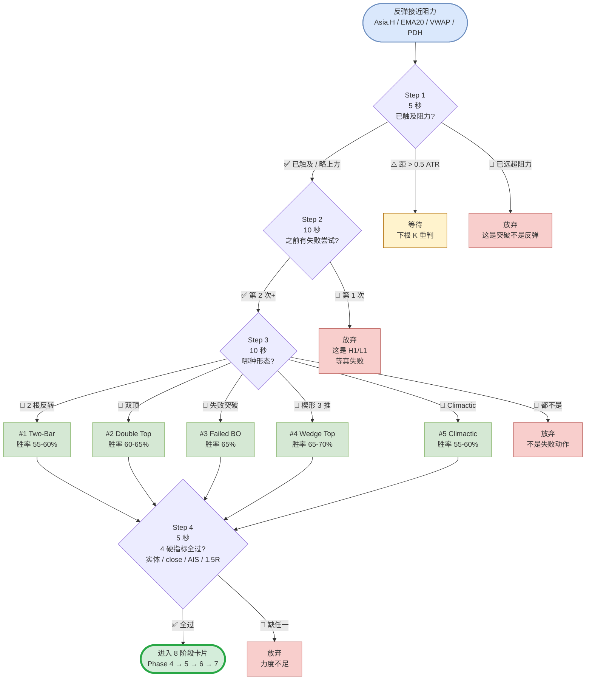

# L2 失败反弹判断流程图

> 30 秒决策流程的可视化版本。对应 `做空方法论.md` §4.1（已确立熊市 + L2 反弹失败）。
> 提供 **draw.io 源文件**（专业可编辑）+ Mermaid（GitHub 内联渲染）+ ASCII（终端友好）三种格式。

---

## 一、推荐查看方式（按场景）

| 场景 | 用哪个 | 文件 |
|---|---|---|
| **桌面 review / 编辑 / 美化输出** | draw.io | `L2-failed-bounce-flowchart.drawio` |
| **GitHub 内联查看 / PR diff** | Mermaid | 见下方第三节 |
| **终端 / 打印 / 桌边卡片** | ASCII | 见下方第四节 |
| **导出为图片** | draw.io 导出 PNG/SVG/PDF | 在 app.diagrams.net 中操作 |

---

## 二、如何打开 draw.io 源文件

### 2.1 浏览器（推荐，免安装）

1. 打开 [https://app.diagrams.net](https://app.diagrams.net)
2. 选择 "Open Existing Diagram"
3. 选择 "Device" → 上传本目录下的 `L2-failed-bounce-flowchart.drawio`
4. 直接编辑 / 导出 PNG / 导出 SVG / 打印

### 2.2 桌面应用

下载 [drawio-desktop](https://github.com/jgraph/drawio-desktop/releases)，双击 `.drawio` 文件即可。

### 2.3 VS Code 插件

安装 `Draw.io Integration` 插件，VS Code 内直接编辑。

### 2.4 导出建议

| 用途 | 建议格式 | 说明 |
|---|---|---|
| 嵌入 markdown / GitHub | SVG | 矢量，缩放不失真 |
| 桌边打印 A4 | PDF | 支持页面缩放 |
| 截图分享 / 微信 | PNG (300 dpi) | 高清位图 |
| 二次编辑 | 保留 .drawio | 永远以源文件为主 |

---

## 三、Mermaid 版本（GitHub 自动渲染）



---

## 四、ASCII 版本（终端友好，可打印）

```plain
                    ┌─────────────────────────────┐
                    │   反弹接近阻力 (Asia.H /     │
                    │   EMA20 / VWAP / PDH)       │
                    └─────────────┬───────────────┘
                                  ↓
                    ┌─────────────────────────────┐
                    │ Step 1 (5 秒)                │
                    │ 已触及关键阻力?               │
                    └─────────────┬───────────────┘
                                  │
                  ┌───────────────┼───────────────┐
                  ↓               ↓               ↓ 失败
            ✅ 已触及          ⚠️ 距 > 0.5ATR    🛑 已远超阻力
                  ↓               ↓               ↓
                  │              [等待]          [放弃 — 是突破]
                  ↓
                    ┌─────────────────────────────┐
                    │ Step 2 (10 秒)               │
                    │ 之前已经有【一次】失败尝试? │
                    └─────────────┬───────────────┘
                                  │
                          ┌───────┼───────┐
                          ↓               ↓ 失败
                  ✅ 第 2 次+        🛑 第 1 次
                          ↓               ↓
                          │           [放弃 — H1/L1, 等失败]
                          ↓
                    ┌─────────────────────────────┐
                    │ Step 3 (10 秒)               │
                    │ 当前是哪种形态?              │
                    └─────────────┬───────────────┘
                                  │
       ┌──────┬──────┬──────┬─────┼─────┬─────────────┐
       ↓      ↓      ↓      ↓     ↓     ↓ 失败
      📌 #1  📌 #2  📌 #3  📌 #4  📌 #5  🛑 都不是
      2根    双顶   失败   楔形   衰竭
      反转          突破   3 推   K
      55-60% 60-65% 65%   65-70% 55-60%   ↓
       │      │      │     │     │     [放弃 — 噪音]
       └──────┴──┬───┴─────┴─────┘
                  ↓
                    ┌─────────────────────────────┐
                    │ Step 4 (5 秒)                │
                    │ 4 硬指标全部满足?            │
                    │   □ 实体 ≥ 0.5 × ATR         │
                    │   □ close 在下 30%           │
                    │   □ 多周期 AIS (≥ 2 致)      │
                    │   □ 距下方支撑 ≥ 1.5R        │
                    └─────────────┬───────────────┘
                                  │
                          ┌───────┼───────┐
                          ↓               ↓ 失败
                  ✅ 全过           🛑 缺任一
                          ↓               ↓
            ✅ 进入 8 阶段卡片         [放弃 — 力度不足]
            Phase 4 → 5 → 6 → 7
            
            入场: 信号 K close - 1 tick
            (Sell Stop)
```

---

## 五、节点语义说明

| 节点 | 含义 | 输出 | 颜色（draw.io） |
|---|---|---|---|
| **Start** | 触发：5min K 反弹接近预定阻力位 | 进入 Step 1 | 蓝色 (起点) |
| **Step 1** | 距离过滤——确认价格真的在阻力区 | 通过 / 等待 / 放弃 | 黄色 (决策) |
| **Step 2** | 计数过滤——区分 H1/L1（80% 失败）和 H2/L2（高概率） | 通过 / 放弃 | 黄色 (决策) |
| **Step 3** | 形态识别——5 个 Brooks 经典中的哪一个 | 5 选 1 / 都不是 | 黄色 (决策) |
| **#1-#5** | 5 种具体形态 + 胜率 | 进入 Step 4 | 绿色 (形态) |
| **Step 4** | 硬指标检查——量化的最后关 | 通过 / 放弃 | 黄色 (决策) |
| **GO** | 通过所有过滤，进入下游 Phase 4-7 | 接入主决策卡 | 深绿 (通过) |
| **X1-X4** | 终止节点——明确说明放弃原因 | 不交易 | 红色 (放弃) |
| **Wait** | 暂时等待节点——可能下一根 K 会变 | 重新 Step 1 | 橙色 (等待) |

---

## 六、流程统计

> 数一下出口数：

| 出口类型 | 数量 | 占比 |
|---|---|---|
| ✅ 通过出口 | 1 | **14%** |
| 🛑 放弃出口 | 4 | 57% |
| ⚠️ 等待出口 | 1 | 14% |
| 📌 形态分支 | 5 | (中间节点) |

> 🛑 **6:1 的否决率**就是这个流程的本质。
> 业余每 7 个机会做 6 个，专业每 7 个机会做 1 个。
> **执行越严格，你越像专业**。

---

## 七、使用场景

### 7.1 实盘中

```plain
看到反弹接近阻力 → 打开 .drawio 文件浏览器版
                  → 用手指 / 鼠标顺着流程走一遍
                  → 任一节点否决 → 不开仓
                  → 通过 → 进入 8 阶段卡片
```

### 7.2 教学 / 复盘

```plain
对着图复盘:
  - 上次开仓走到流程图的哪一步?
  - 是哪一关检查没做严?
  - 下次怎么改?
```

### 7.3 交易日志

```plain
每笔 setup 出现时, 在日志记录:
  "本次卡在 Step___, 放弃原因: ___"
  或
  "本次通过 Step 1-4, 形态 #___, 入场..."
```

---

## 八、与本仓库其他文件的关系

| 文件 | 关系 |
|---|---|
| `做空方法论.md` §4.1 | 本流程图是其**可视化版本** |
| `做空方法论.md` §4.1 详细形态 | 流程图节点 #1-#5 的**展开说明** |
| `8 阶段桌边卡片` (做空方法论 附录 A) | 本流程图通过后**进入 Phase 4** |
| `Always-In 判断卡` | Step 4 硬指标第 3 项依赖此卡 |
| `_credo.md` | 流程图严格执行的**心理基础** |

---

## 九、变更日志

```plain
v1.0 (2026-05):
  - 初版
  - draw.io 源文件 + Mermaid + ASCII 三格式
  - 5 形态 + 4 硬指标 + 6 个出口
  - 与做空方法论 §4.1 完全对齐
```
