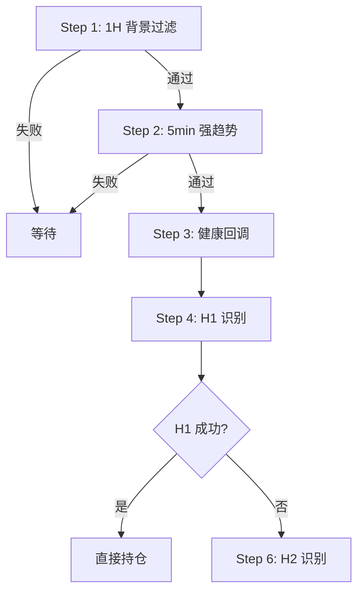
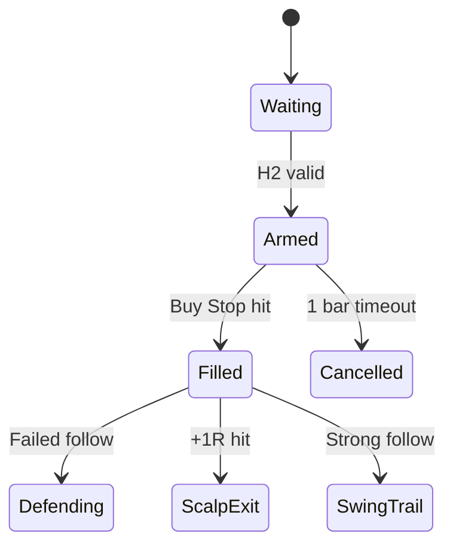

# canvas-design — 流程图与可视化规范

> 本文件等价于 Claude 的 `/canvas-design` skill，在本仓库 (priceAction) 内自动生效。
> 用于约束所有流程图、状态图、决策树、形态示意的输出风格。

## 1. 选型决策

| 想画的东西 | 用什么 |
|---|---|
| 决策流程（10 步序列） | Mermaid `flowchart TD` 或 ASCII 箭头 |
| 状态机（持仓状态变化） | Mermaid `stateDiagram-v2` |
| K 线形态示意（H1 / H2 / 回调） | ASCII art bar chart |
| 参数关系树 | ASCII 缩进树 |
| 时间序列示意（leg / pullback / leg） | ASCII 折线图 |

> 优先 ASCII，便于 GitHub / 终端 / diff 中阅读。需要图形美感时再用 Mermaid。

## 2. ASCII 流程箭头

固定使用：

```
步骤 1 → 步骤 2 → 步骤 3
         ↓ 失败
       返回等待
```

- 主流程横向 `→`，分支向下 `↓`。
- 失败/取消分支永远写在右侧并标注"失败"或具体原因。
- 终止节点用方括号包裹：`[返回等待]` / `[取消挂单]` / `[全平仓位]`。

## 3. K 线形态 ASCII

**强多头 K 线（close 在上 30%）：**

```
high  ─┐
       │
       │█  ← body ≥ 0.4 ATR
       │█
close ─┤█
       │
low   ─┘
```

**强空头 K 线（close 在下 30%）：** 镜像即可。

**H2 形态示意（多头）：**

```
       Leg_High ●
                 \
                  \      ← 健康回调
                   \
                    ●  H1 (失败)
                   /
                  ●─── ← 二次反弹
                 /
              H2 ●  ← 信号 K
                /
   Current_PB_Low
```

## 4. Mermaid 模板

### 4.1 决策流程

````markdown

````

### 4.2 状态机

````markdown

````

## 5. 颜色与符号语义

强制约定（全文档统一）：

| 符号 | 含义 |
|---|---|
| ✅ | 必须满足的条件 |
| ❌ | 必须不满足的条件 |
| ⚠️ | 注意事项 / 边界情况 |
| 📌 | 关键参数或锚点 |
| 🔁 | 循环或重试逻辑 |
| 🛑 | 强制停止 / 失效 |

不要使用其他装饰性 emoji（🚀🎉 等）。

## 6. 图与表的优先级

能用表格说清的事情，优先用表格而不是流程图：

```markdown
| 入场质量 | 跟随质量 | 行动 |
|---|---|---|
| Strong | Strong | 正常持仓 |
| Strong | Weak | 防守模式 |
| Weak | * | 立即退出 |
```

只有当存在**真正的分支或循环**时才画流程图。
